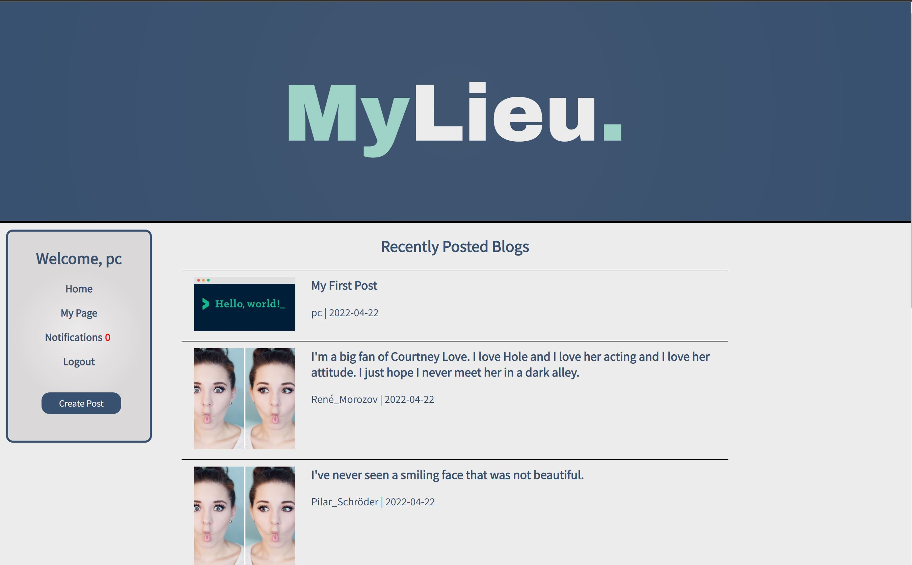
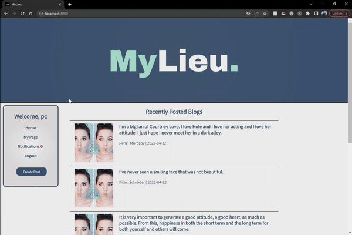
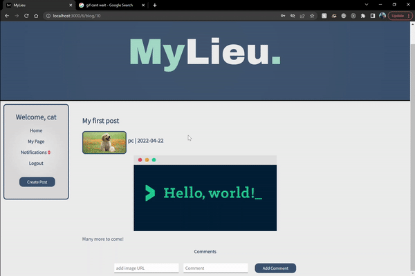

# MyLieu

##### Created By: Austin Haubenschild  [Github](https://github.com/Haubaustin)| Piero Caceres [LinkedIn](https://www.linkedin.com/in/pcace/) [Github](https://github.com/pierocaceres) | Michelle Yang [LinkedIn](https://www.linkedin.com/in/myang292/) [Github](https://github.com/myang292) | Shubhro Bandyopadhyay [LinkedIn](https://www.linkedin.com/in/shubhro-bandyopadhyay-8420a321b/) [Github](https://github.com/sbandy9210)

## Desprciption

MyLieu (derived from milieu) is a social publishing platform that enables users to create, read, and share diverse stories and insights that takes inspiration from popular blog sites such as medium and reddit. MyLieu is a full stack app that features popular articles and blog posts on a wide variety of topics and allows registered users to like posts, leave comments or even create their own blog post on whatever they like!

## Features
 
### Create Post

### Leave comment on post or reply to comment.

 

## Entity Relationship Diagram (ERD)

## Component Hierarchy Diagram

## Technologies Used
- Postresql
- Express
- React 
- Node
- Trello
- Figma
- Lucid 

## Links

[MyLieu ERD](https://lucid.app/lucidchart/9c3d9e18-783a-4ce5-9f99-86bb6155ca54/edit?invitationId=inv_ff498189-fb9a-4553-8767-7f836a537941)

[MyLieu Component Heirarchy](https://lucid.app/lucidchart/cdc01586-ef27-4dad-9373-ed18c2d15c3a/edit?invitationId=inv_64e3ad50-98cc-401a-a879-c5e3af42af11)

[Trello](https://trello.com/b/2vSWUIo0/mylieu) 

[Figma](https://www.figma.com/file/pESfXpcMigEUmsyMkLv8no/P3-Milieu?node-id=0%3A1)

[Google Slides](https://docs.google.com/presentation/d/1e5hPQGSh_qkH83grIi-yDLJ1wwJsiVBWJzHhvYnmBX0/edit?usp=sharing)

## Credit

[Modal Design](https://medium.com/tinyso/how-to-create-a-modal-component-in-react-from-basic-to-advanced-a3357a2a716a)

[Stick Navigation](https://dev.to/dalalrohit/sticky-navbar-from-scratch-using-react-37d5)